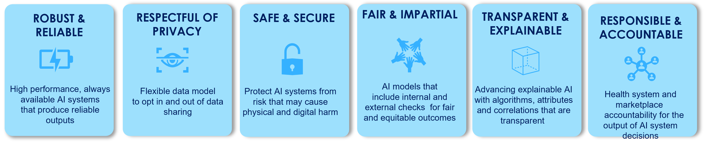

# Equality AI `responsible_mlops`

In 2019, [Obermeyer et al.]() revealed a Healthcare commercial prediction algorithm <i>exhibiting significant racial bias</i> that had gone <b>undetected</b>, resulting in <b>millions of Black patients</b> with complex medical needs not qualifying for extra care, despite being considerably sicker than White patients. Recent scrutiny of machine learning (ML) usage in healthcare systems has revealed numerous examples of harmful medical decisions made at the <b>expense of minority and vulnerable populations.</b> Medical professionals and researchers relying on ML models to assist in decision making are often unaware of the bias unintentionally introduced into algorithms by real-world data that incorporates inherent unfairness and produces biased outcomes that widen the gap in healthcare inequity.   

  
<i>More studies ...</i>

  

  

Data scientists are the newest members of the healthcare team, and as such, the Hippocratic Oath applies:  First do no harm.  Developers must accept greater responsibility to ensure the ML models they develop do no harm.  Unfortunately, the typical tools and MLOps workflows available to developers have proven to be insufficient for this task. Responsible AI is an emerging framework that addresses this need and helps mitigate the potential risks of harm from AI and includes ethics, fairness, accuracy, security, and privacy.  

  
<i>See full framework ...</i>

  
  

Equality AI is the first organization to begin assembling the Responsible AI framework into an end-to-end Responsible MLOPs Studio. The technology behind our Responsible MLOPs Studio is an open source ML software framework and tool, called `responsible_mlops’, with additional functions  that can be selectively incorporated to create various workflows for fitting responsible models. 

We recognize and correct the missing pieces in traditional MLOps:

* Fairness metrics
* Bias mitigation methods and strategies
* Transparency and oversight
* Updated end-to-end MLOps workflows

Our tools ensure the healthcare MLOps workflow includes bias reduction and fair modeling - Every algorithm, every time.  
Equality AI believes in AI for good, AI that is fair, and AI for equity.  Will you join us and become a health care hero in your development journey?

## `responsible_mlops` 
To make steps in our `responsible_mlops` easy to follow, we have likened these various workflows to something everyone can understand—a recipe. These recipes outline the “ingredients” you need and the exact steps to take to ensure you’ve cooked up a fair AI system. [Our first recipe is a fair preprocessing ML recipe]() and the main goal of this recipe is to repair the data set on which the model is run (pre-processing). 

Sign up to hear when we release recipes that will tackle adjustments to the model (in processing) and the predictions (post-processing).

## Highlights
`fairness_tree_metric` 
`mitigation_method_mapping`

## Responsible AI Takes a Community
We are starting with fairness, and it doesn’t end there. We have much more in the works,  and we want to know—what do you need? Do you have a Responsible AI challenge you need to solve? Drop us a line and let’s see how we can help!

## Contributing to the project

## Authors

[Equality AI](https://equality-ai.com/) is a public benefit corporation dedicated to helping data scientists close the health disparity gap by assembling a Responsible AI framework into tools that include modernized, end-to-end MLOps with functions that can be selectively incorporated to create various workflows designed to produced equitable, responsible models.     
